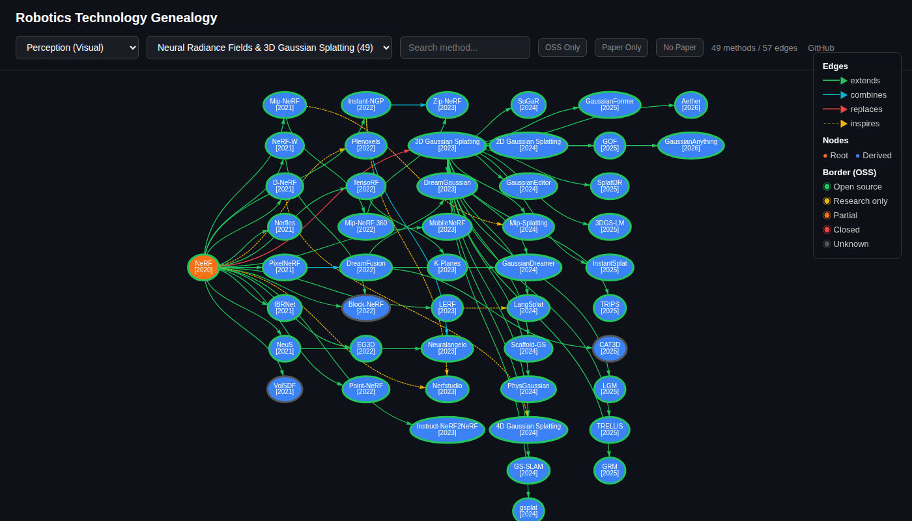

# robotics-technology-genealogy

Interactive genealogy tree visualizer for Robotics & AI technologies.

ロボティクス・AI技術がどこから派生し、どう分岐したかをインタラクティブな系譜図で表示します。

**[Live Demo](https://rsasaki0109.github.io/robotics-technology-genealogy/)**



## Features

- Interactive graph with chronological left-to-right layout
- Click any node to see arXiv / GitHub links, stars, tags, license
- Search any technology and jump to its domain tree
- Filter by OSS status (open/closed/research), paper availability
- Stats dashboard (methods per year, OSS ratio, top repos)
- Category browsing: Perception, Planning, Robot Learning, Foundation Models, etc.
- GitHub star counts auto-updated weekly via GitHub Actions
- Mobile responsive

## Domains

| Category | Domains |
|----------|---------|
| **Perception (LiDAR/3D)** | LiDAR SLAM, 3D Detection, Point Cloud Denoising, Scene Flow, Place Recognition |
| **Perception (Visual)** | NeRF/3DGS, Image Matching, Visual SLAM, Depth, 2D Detection, Segmentation, Optical Flow, Object Tracking |
| **Planning & Control** | Motion Planning, Robot Control, E2E Autonomous Driving |
| **Robot Learning** | Imitation Learning, World Models, Legged Robots, Grasp Planning |
| **Foundation Models** | LLM, VLM, Diffusion Models, Vision Backbone, Reinforcement Learning |
| **Platforms & Simulation** | Robot Simulation, Robot Middleware, Medical Robotics |

## Relation Types

| Color | Type | Meaning |
|-------|------|---------|
| Green `━━▶` | `extends` | Direct extension of the same approach |
| Cyan `━━▶` | `combines` | Merges ideas from multiple methods |
| Red `━━▶` | `replaces` | Paradigm shift (rare) |
| Yellow `╌╌▶` | `inspires` | Indirect influence |

## Install

```bash
pip install -e .
```

## CLI Usage

```bash
# Show genealogy tree
robotics-technology-genealogy show
robotics-technology-genealogy show neural_radiance_fields

# Trace ancestors
robotics-technology-genealogy ancestors "3D Gaussian Splatting"

# Show details
robotics-technology-genealogy info "LoFTR"

# List with filters
robotics-technology-genealogy list --tag transformer
robotics-technology-genealogy list --year 2025
```

## Web UI (Local)

```bash
pip install -e ".[web]"
streamlit run web/app.py
```

## Adding a Domain

See [CONTRIBUTING.md](CONTRIBUTING.md) for details.

```yaml
name: Your Domain Name
description: Brief description

methods:
  - name: "MethodName"
    paper: "Full Paper Title"
    arxiv: "XXXX.XXXXX"
    year: 2024
    code: "github-user/repo"
    stars: 1000
    open_source: open  # open | research | partial | closed
    license: "MIT"
    tags: [tag1, tag2]
    parents:
      - name: "ParentMethod"
        relation: extends  # extends | combines | replaces | inspires
    description: "One-line description"
```

## Auto-update Stars

Runs weekly via GitHub Actions. Manual:

```bash
GITHUB_TOKEN=your_token python scripts/update_stars.py
```

## License

MIT
